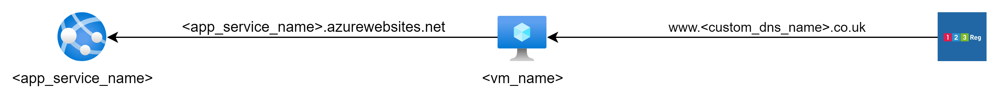

# barracuda-waf-poc

### Description
This proof of concept is designed to look at how to automate the deployment of barracuda WAF to a virtual machine and how to manage the barracuda configuration using terraform.

### Arcitecture Diagram


### Steps Overview
1) Deploy Bicep
2) Manually set web stack and deployment configuration
3) Manually activate Barracuda license
4) Create A record for custom DNS pointed at the Public IP the bicep deploys.
5) Deploy WAF config

### Steps to deploy
1) Create resource group:

```az group create --name csr-dev-uks-rg --location uksouth```

2) Deploy bicep files

```az deployment group create --resource-group csr-dev-uks-rg --template-file ./infra/web-app.bicep --parameters ./infra/parameters/dev.bicepparam```

``` az webapp deploy --resource-group csr-dev-uks-rg --name csr-dev-uks-app --src-path ./src/myDotNetApp.zip --type zip```

When using cloud shell use the following:

Modify the paramters file to be 

``` using '../calum/web-app.bicep' ```

Deploy Bicep file
``` az deployment group create --resource-group csr-dev-uks-rg --template-file ./web-app.bicep --parameters ./dev.bicepparam ```

3) Once Web App is deployed, manually set web stack and deployment configuration

4) Manually Activate the Barracuda WAF license, by navigating to "http://<PublicIpAddress>:8000" and following the onscreen instructions

5) Create an A record for your custom domain pointed at the Public Ip Address of the Virtual Machine

6) Deploy the WAF configuration via terraform

``` terraform init ```
``` terraform apply -var-file='dev-waf.tfvars' ```

7) Check access you website using by naviating to http://<customHostname> 

8) Teardown environment

``` terraform destroy -var-file='dev-waf.tfvars' ```
``` az group delete --name csr-dev-uks-rg ```

### Future Improvements
- Fully automate build, deployment and configuration by putting inside YAML pipeline, ensuring that the bicep outputs certain inputs into the waf configuration
- Automate the manual intevention steps
- Modulise the WAF config with modules to enable working on a larger scale
- Deploy config to enable https
